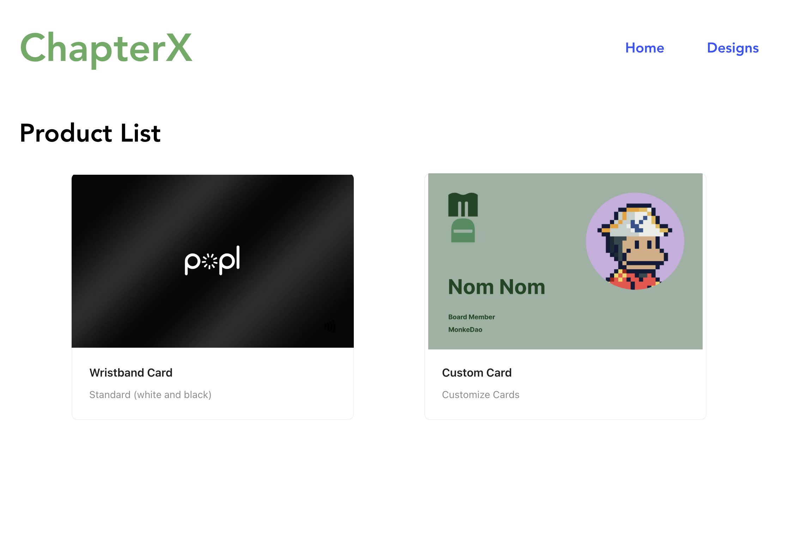
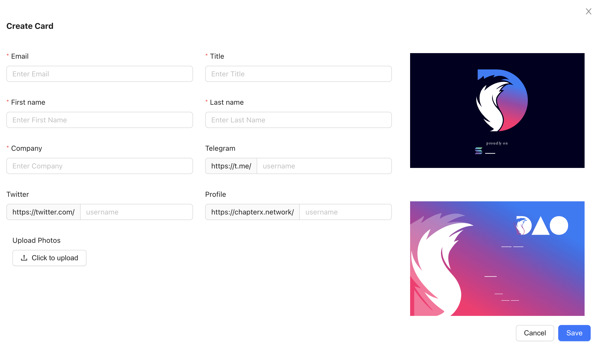
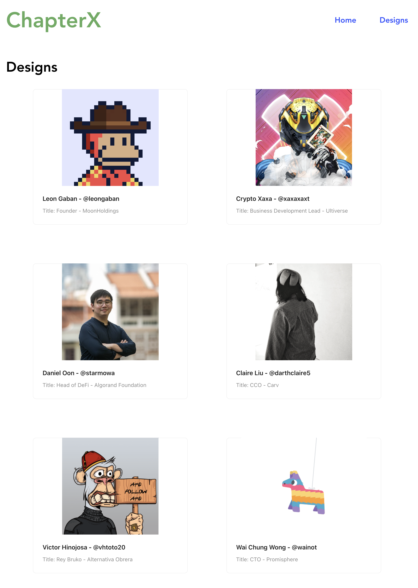
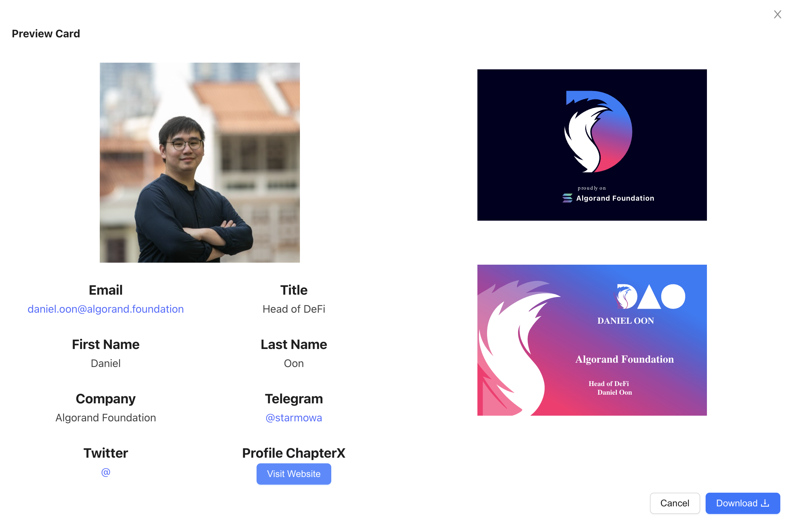

# ChapterX Card

A storefront that has two products. One product is a standard wristband (white and black colors), and another product is a custom card

## About

This project uses [Vite](https://vitejs.dev/) as frontend and [json-server](https://github.com/typicode/json-server) as backend, allow users to create data (stored in lowdb) and upload files (stored in system folder `src/server/public/assets/images`).

Client path: [src/client/](./src/client/main.tsx)
Server path: [src/server/](./src/server/index.ts)

## Installation

Clone this project, then install dependencies using yarn:

```bash
yarn install --frozen-lockfile
```

The data is stored in [src/server/db.json](./src//server/db.json), you can import the expected data (as `.csv`) by:

- Put the csv file in `src/server/data/`
- Rename the file as `sample-data.csv`
- Run seed script:

```bash
yarn seed
```

## Starting applications

Run the script:

```bash
yarn dev
```

This project use [concurrently](https://github.com/open-cli-tools/concurrently#readme) to start both frontend and backend application at the same time, or you can run manually each:

```bash
# Frontend app
yarn client:dev

# Backend app
yarn server:dev
```

After starting all applications:

- Backend application will be launched at: [http://localhost:3000/](http://localhost:3000/)
- Frontend application will be launched at: [http://localhost:5173/](http://localhost:5173/)
- Frontend will have a proxy that connect to backend at: [http://localhost:5173/api](http://localhost:5173/api)

## Demo application

Product List


Create Card with preview feature:


Design List


Preview Card with `download card, visit website, open in twitter, telegram, etc.`

